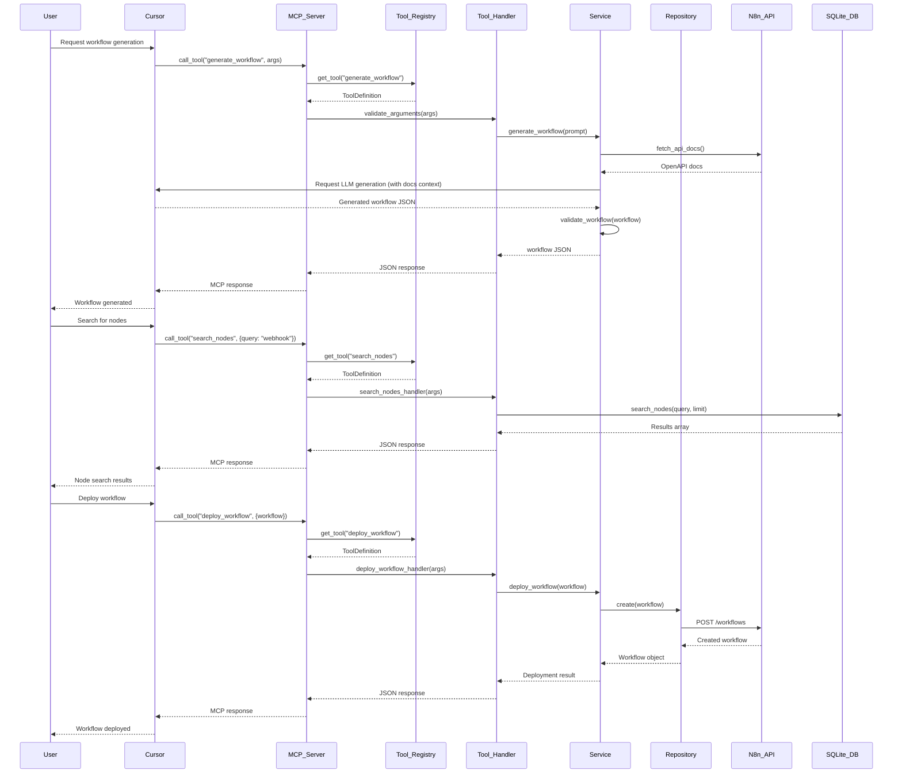
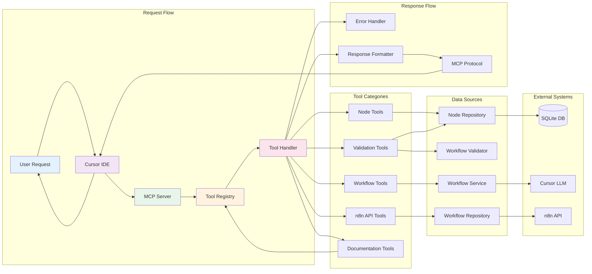
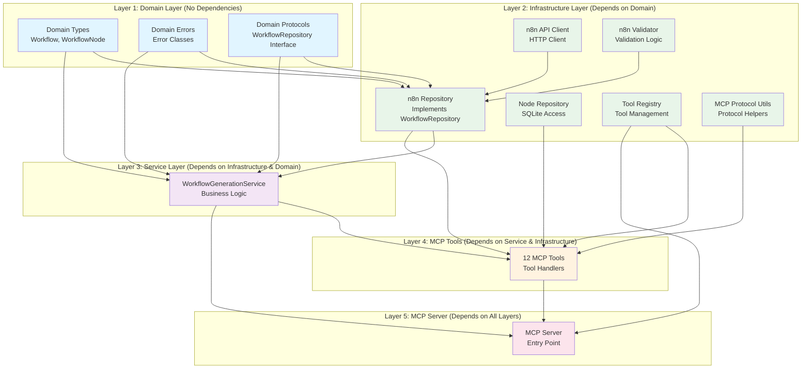
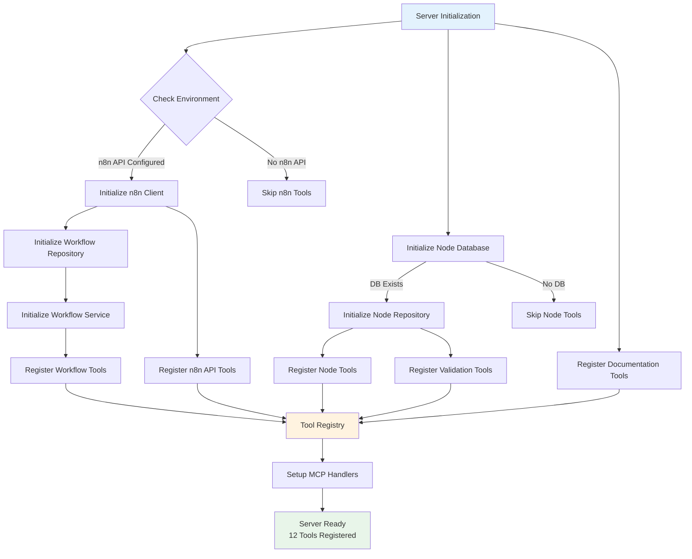
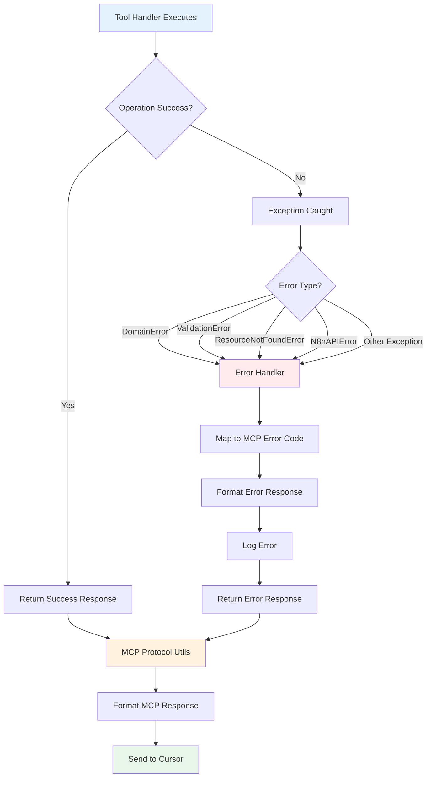
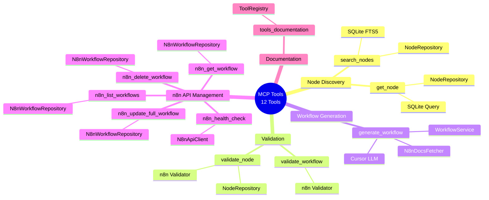
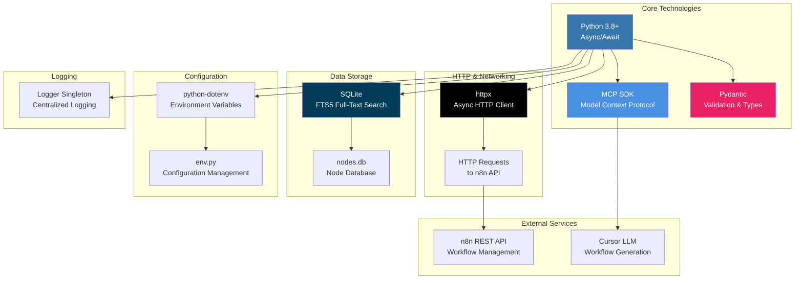

# n8n Workflow Generator MCP Server - Architecture Diagram

## Complete System Architecture

```mermaid
graph TB
    subgraph "External Systems"
        Cursor[Cursor IDE<br/>LLM Integration]
        N8nAPI[n8n REST API<br/>localhost:5678]
        SQLite[(SQLite Database<br/>nodes.db)]
    end

    subgraph "MCP Server Entry Point"
        Main[__main__.py<br/>N8nWorkflowGeneratorServer]
        MCPProtocol[MCP Protocol Handler<br/>stdio_server]
    end

    subgraph "Domain Layer - Core Business Logic"
        DomainTypes[types.py<br/>Workflow<br/>WorkflowNode]
        DomainErrors[errors.py<br/>DomainError<br/>ValidationError<br/>ResourceNotFoundError<br/>N8nAPIError]
        DomainProtocol[WorkflowRepository<br/>Protocol Interface]
    end

    subgraph "Service Layer - Business Orchestration"
        WorkflowService[WorkflowGenerationService<br/>- Generate workflows<br/>- Validate workflows<br/>- Deploy workflows]
    end

    subgraph "Infrastructure Layer - External Integrations"
        subgraph "n8n Integration"
            N8nClient[n8n_api_client.py<br/>- create_workflow<br/>- get_workflow<br/>- update_workflow<br/>- delete_workflow<br/>- list_workflows<br/>- activate/deactivate<br/>- health_check]
            N8nValidator[n8n_validator.py<br/>- validate_workflow_structure<br/>- clean_workflow_for_create<br/>- clean_workflow_for_update]
            N8nDocsFetcher[n8n_docs_fetcher.py<br/>- fetch_docs<br/>- format_docs_for_llm]
            N8nConfig[n8n_config.py<br/>API Configuration]
            N8nRepo[n8n_workflow_repository.py<br/>Implements WorkflowRepository]
            BaseRepo[base_repository.py<br/>Base Repository]
        end

        subgraph "Database Layer"
            NodeRepo[node_repository.py<br/>- search_nodes<br/>- get_node<br/>FTS5 Search]
        end

        subgraph "MCP Protocol Layer"
            ToolRegistry[tool_registry.py<br/>ToolRegistry Singleton<br/>- register_tool<br/>- get_tool<br/>- get_all_tools]
            ProtocolUtils[protocol_utils.py<br/>- create_tool_from_definition<br/>- validate_tool_arguments<br/>- create_text_content<br/>- create_error_content]
            ErrorHandler[error_handler.py<br/>- handle_error<br/>- map_error_to_code<br/>MCPErrorCode Enum]
            ResponseFormatter[response_formatter.py<br/>Format responses]
        end

        subgraph "MCP Tools - 12 Tools"
            subgraph "Node Discovery Tools"
                Tool1[search_nodes<br/>Search n8n nodes]
                Tool2[get_node<br/>Get node details]
            end

            subgraph "Validation Tools"
                Tool3[validate_node<br/>Validate node config]
                Tool4[validate_workflow<br/>Validate workflow]
            end

            subgraph "Workflow Generation"
                Tool5[generate_workflow<br/>Generate from prompt]
            end

            subgraph "n8n API Management"
                Tool6[n8n_health_check<br/>Check API health]
                Tool7[n8n_list_workflows<br/>List workflows]
                Tool8[n8n_get_workflow<br/>Get workflow]
                Tool9[n8n_update_full_workflow<br/>Update workflow]
                Tool10[n8n_delete_workflow<br/>Delete workflow]
            end

            subgraph "Documentation"
                Tool11[tools_documentation<br/>Get tool docs]
            end
        end

        subgraph "Tool Registration Modules"
            WorkflowTools[workflow_tools.py<br/>register_workflow_tools]
            NodeTools[node_tools.py<br/>register_node_tools]
            ValidationTools[validation_tools.py<br/>register_validation_tools]
            N8nAPITools[n8n_api_tools.py<br/>register_n8n_api_tools]
            DocTools[documentation_tools.py<br/>register_documentation_tools]
        end

        subgraph "Utilities"
            Logger[logger.py<br/>Logger Singleton]
            Env[env.py<br/>Configuration<br/>Environment Variables]
            Cache[cache/<br/>Caching Layer]
        end
    end

    %% External Connections
    Cursor -->|MCP Protocol<br/>stdio| Main
    Main -->|HTTP Requests| N8nAPI
    NodeRepo -->|SQL Queries| SQLite
    WorkflowService -->|Uses| Cursor

    %% Domain Layer Connections
    DomainTypes -.->|Used by| WorkflowService
    DomainErrors -.->|Raised by| WorkflowService
    DomainProtocol -.->|Implemented by| N8nRepo

    %% Service Layer Connections
    Main --> WorkflowService
    WorkflowService --> N8nRepo
    WorkflowService --> N8nValidator

    %% Infrastructure Layer Connections
    Main --> ToolRegistry
    Main --> N8nClient
    Main --> NodeRepo
    N8nRepo --> N8nClient
    N8nRepo --> N8nValidator
    N8nRepo --> BaseRepo
    BaseRepo --> N8nClient
    BaseRepo --> Logger

    %% Tool Registration
    WorkflowTools --> ToolRegistry
    NodeTools --> ToolRegistry
    ValidationTools --> ToolRegistry
    N8nAPITools --> ToolRegistry
    DocTools --> ToolRegistry

    %% Tool Handlers
    Tool1 --> NodeRepo
    Tool2 --> NodeRepo
    Tool3 --> NodeRepo
    Tool4 --> N8nValidator
    Tool5 --> WorkflowService
    Tool5 --> N8nDocsFetcher
    Tool6 --> N8nClient
    Tool7 --> N8nRepo
    Tool8 --> N8nRepo
    Tool9 --> N8nRepo
    Tool10 --> N8nRepo
    Tool11 --> ToolRegistry

    %% MCP Protocol Flow
    Main --> MCPProtocol
    MCPProtocol --> ProtocolUtils
    ProtocolUtils --> ToolRegistry
    ProtocolUtils --> ErrorHandler
    ErrorHandler --> DomainErrors

    %% Configuration
    Env --> Main
    Env --> N8nClient
    N8nConfig --> N8nClient

    %% Logging
    Logger -.->|Used by| Main
    Logger -.->|Used by| WorkflowService
    Logger -.->|Used by| N8nRepo
    Logger -.->|Used by| ToolRegistry

    %% Styling
    classDef domainLayer fill:#e1f5ff,stroke:#01579b,stroke-width:2px
    classDef serviceLayer fill:#f3e5f5,stroke:#4a148c,stroke-width:2px
    classDef infraLayer fill:#e8f5e9,stroke:#1b5e20,stroke-width:2px
    classDef toolLayer fill:#fff3e0,stroke:#e65100,stroke-width:2px
    classDef external fill:#fce4ec,stroke:#880e4f,stroke-width:2px

    class DomainTypes,DomainErrors,DomainProtocol domainLayer
    class WorkflowService serviceLayer
    class N8nClient,N8nValidator,N8nRepo,NodeRepo,ToolRegistry,ProtocolUtils,ErrorHandler infraLayer
    class Tool1,Tool2,Tool3,Tool4,Tool5,Tool6,Tool7,Tool8,Tool9,Tool10,Tool11 toolLayer
    class Cursor,N8nAPI,SQLite external
```

## Data Flow Diagram

## Component Interaction Diagram

## Layer Dependencies Diagram

## Tool Registration Flow

## Error Handling Flow

## Complete Tool List with Dependencies

## Technology Stack Diagram

---

## Architecture Principles

### 1. Clean Architecture
- **Domain Layer**: Pure business logic, no dependencies
- **Infrastructure Layer**: External integrations, depends on domain
- **Service Layer**: Business orchestration, depends on infrastructure
- **MCP Layer**: Protocol implementation, depends on all layers

### 2. Dependency Inversion
- Domain defines protocols (interfaces)
- Infrastructure implements protocols
- Service depends on protocols, not implementations

### 3. Singleton Pattern
- `ToolRegistry`: Single source of truth for tools
- `Logger`: Centralized logging

### 4. Repository Pattern
- Abstracts data access
- Enables testing with mocks
- Clean separation of concerns

### 5. Error Handling
- Domain-specific errors
- Mapped to MCP error codes
- Consistent error responses

---

## Key Components Summary

| Component | Purpose | Dependencies |
|-----------|---------|--------------|
| **N8nWorkflowGeneratorServer** | Main entry point | All layers |
| **ToolRegistry** | Tool management | None (singleton) |
| **WorkflowGenerationService** | Business logic | Repository, Validator |
| **N8nWorkflowRepository** | Data access | API Client, Validator |
| **NodeRepository** | Node database access | SQLite |
| **N8nApiClient** | HTTP client | httpx, config |
| **MCPProtocolUtils** | Protocol helpers | MCP SDK |
| **ErrorHandler** | Error mapping | Domain errors |

---

## Tool Count by Category

- **Node Discovery**: 2 tools
- **Validation**: 2 tools  
- **Workflow Generation**: 1 tool
- **n8n API Management**: 5 tools
- **Documentation**: 1 tool
- **Total**: 12 tools

---

*This architecture follows Clean Architecture principles with clear separation of concerns and dependency inversion.*

